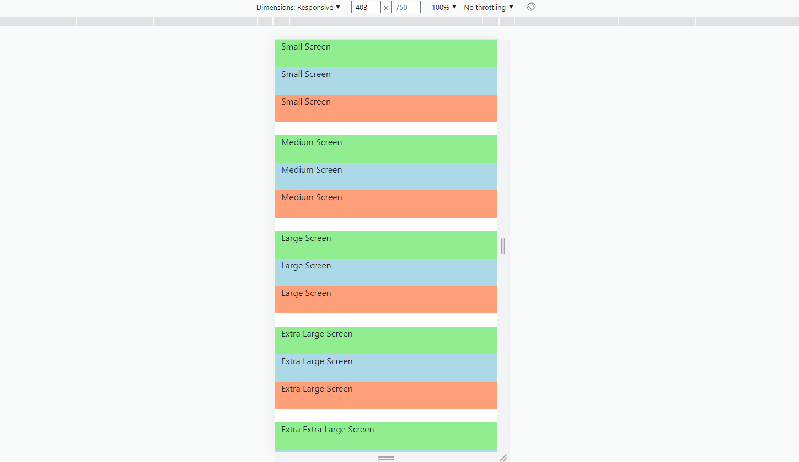
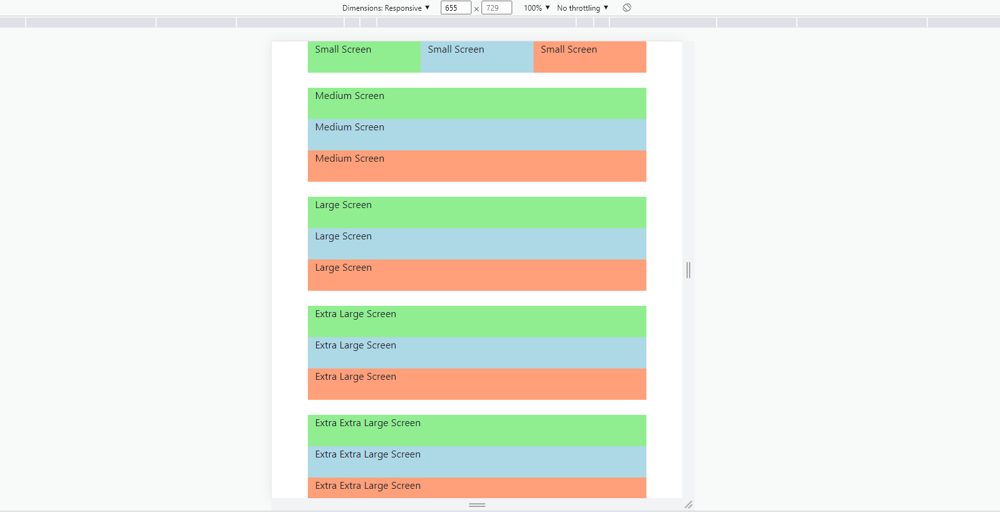
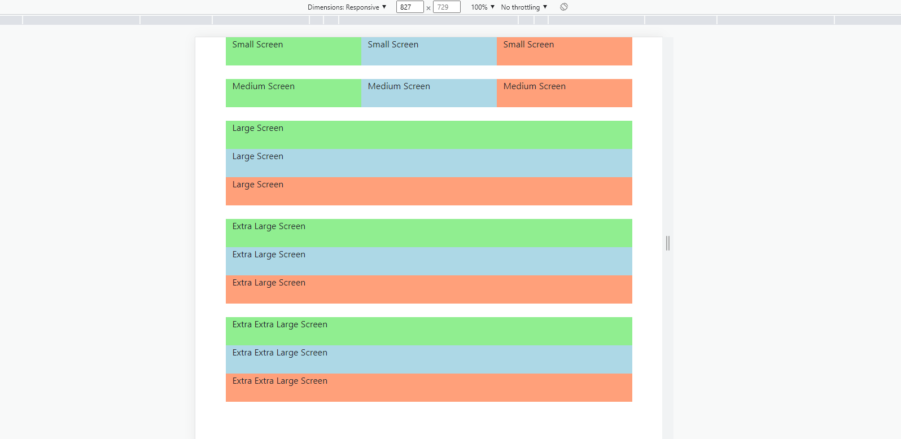
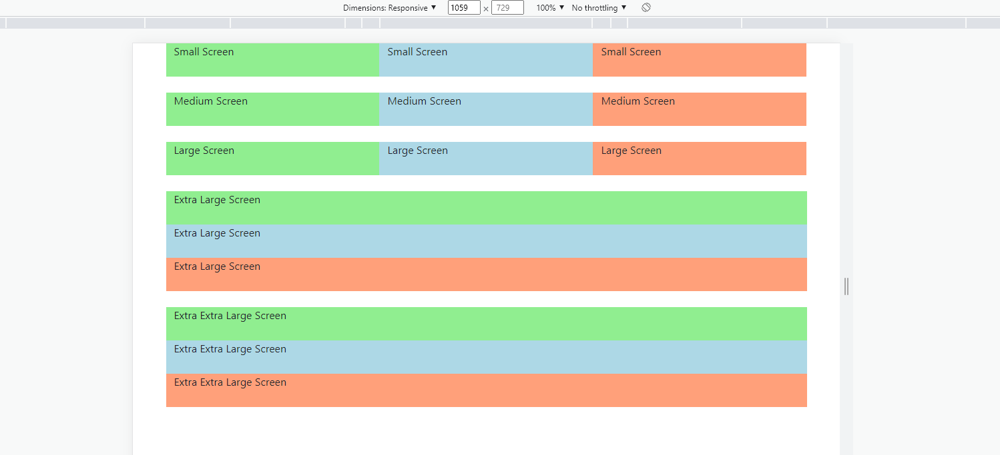
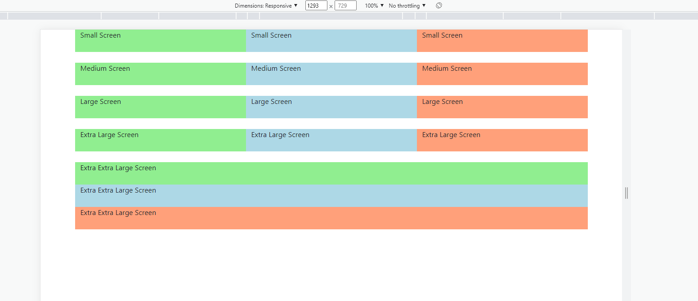
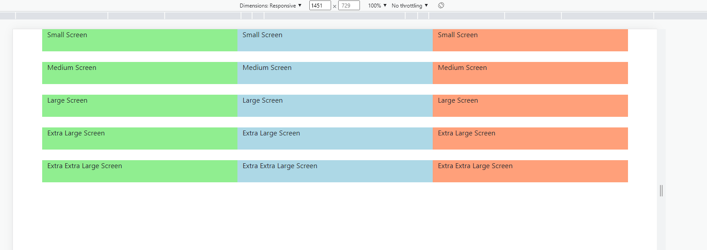

# Learn Bootstrap in 30 Days

### After completing this course, we'll build [10 Projects](#10-bootstrap-projects) with Bootstrap 5.

While you complete the 30-days module, jump in the [Projects Section](#10-bootstrap-projects).

| Day | Topics | Video Explanation |
| :-: | :----: | :---------------: |
| 00  |        |     Watch Now     |
| 01  |        |     Watch Now     |
| 02  |        |     Watch Now     |
| 03  |        |     Watch Now     |
| 04  |        |     Watch Now     |
| 05  |        |     Watch Now     |
| 06  |        |     Watch Now     |
| 07  |        |     Watch Now     |
| 08  |        |     Watch Now     |
| 09  |        |     Watch Now     |
| 10  |        |     Watch Now     |
| 11  |        |     Watch Now     |
| 12  |        |     Watch Now     |
| 13  |        |     Watch Now     |
| 14  |        |     Watch Now     |
| 15  |        |     Watch Now     |
| 16  |        |     Watch Now     |
| 17  |        |     Watch Now     |
| 18  |        |     Watch Now     |
| 19  |        |     Watch Now     |
| 20  |        |     Watch Now     |
| 21  |        |     Watch Now     |
| 22  |        |     Watch Now     |
| 23  |        |     Watch Now     |
| 24  |        |     Watch Now     |
| 25  |        |     Watch Now     |
| 26  |        |     Watch Now     |
| 27  |        |     Watch Now     |
| 28  |        |     Watch Now     |
| 29  |        |     Watch Now     |
| 30  |        |     Watch Now     |

# 10 Bootstrap Projects

| Project No. | Project Name | Video Explanation | Live Demo |
| :---------: | :----------: | :---------------: | :-------: |
|     01      |              |     Watch Now     | Live Demo |
|     02      |              |     Watch Now     | Live Demo |
|     03      |              |     Watch Now     | Live Demo |
|     04      |              |     Watch Now     | Live Demo |
|     05      |              |     Watch Now     | Live Demo |
|     06      |              |     Watch Now     | Live Demo |
|     07      |              |     Watch Now     | Live Demo |
|     08      |              |     Watch Now     | Live Demo |
|     09      |              |     Watch Now     | Live Demo |
|     10      |              |     Watch Now     | Live Demo |

# Day-00: How The Course is Designed

### কোর্সটি যেভাবে সাজানো হয়েছেঃ

- কোর্সটি ৩০ দিনের মেয়াদে ভাগ করা হয়েছে। প্রত্যেকদিন Bootstrap এর বিভিন্ন Topics নিয়ে আলোচনা করা হয়েছে।
- প্রতিটা দিনের Module সাজানো হয়েছে ক্রমানুসারে । উদাহরণস্বরূপ, Day-05 এর টপিকসগুলো শিখতে হলে অবশ্যই আপনাকে Day-04 শেষ করে আসতে হবে। একইভাবে Day-04 শিখতে হলে আপনাকে Day-03 শেষ করে আসতে হবে ।
- প্রতিটা দিনের Topics এর Written Explanation/Article এর সাথে সাথে Video Explanation-ও দেয়া আছে। যাতে শিক্ষার্থীরা খুব সহজেই টপিকসগুলো আত্মস্থ করতে পারে।

### কোর্সটি কাদের জন্য?

- এই কোর্সটিতে যেকেউ অংশগ্রহণ করতে পারবে। শিখার জন্য মনের ইচ্ছাটাই আসল ।
- Course টি মূলত Beginner-friendly. যারা Web Programming এ নতুন তাদেরকে উদ্দেশ্য করেই Course টি সাজানো।

### Prerequisite

- HTML, CSS
- JavaScript (Basic Knowledge Preferrable)

# Day-01: Bootstrap Container and Grid

- [What is Bootstrap and Why Bootstrap?](#what-is-bootstrap-and-why-bootstrap)
- [Boostrap Breakpoints](#bootstrap-breakpoints)

### What is Bootstrap and Why Bootstrap?

- Bootstrap is the most popular, free and open-source HTML, CSS, and JavaScript framework for creating responsive, mobile-first websites.
- Mobile First Website বলতে আসলে কি বুঝায়? কোন একটা Website Code লিখার ক্ষেত্রে আমরা যদি Mobile Screen এ কি রকম দেখাবে সেটা আগে চিন্তা করি এবং সেভাবেই Design করি, তাহলে ঐ Website কে Mobile First Website বলা হয়। Moble First Website এর ক্ষেত্রে আগে Mobile এর কথা মাথায় রাখতে হয়, তারপর ধীরে ধীরে বড় Screen এর কথা মাথায় রেখে তার জন্যও Media Query ব্যবহার করে Codes লিখা হয়।
- Bootstrap এর প্রধান কাজ হলো CSS এর Codes কমিয়ে ফেলা এবং Responsive Design করা। অর্থাৎ একই কাজ আমরা যদি শুধু CSS দিয়ে করি, তাহলে হয়তো অনেক Codes লিখতে হবে, যেখানে Bootrap ব্যবহার করার ফলে খুব কম Codes লিখেই আমরা সেই কাজটি করে ফেলতে পারি। এরফলে, সময়ও আমাদের কম লাগে।

### Bootstrap Breakpoints

|  **Breakpoint**   | **Class Infix** | **Dimensions** | **Specific Range** |
| :---------------: | :-------------: | :------------: | :----------------: |
|    Extra Small    |      None       |     <576px     |      0-575px       |
|       Small       |       sm        |     ≥576px     |     576-767px      |
|      Medium       |       md        |     ≥768px     |     768-991px      |
|       Large       |       lg        |     ≥992px     |     992-1199px     |
|    Extra Large    |       xl        |    ≥1200px     |    1200-1399px     |
| Extra Extra Large |       xxl       |    ≥1400px     |   1400-unlimited   |

### Creating Our First Bootstrap Page

#### With 'container' Class

- Container Class আমাদের একটা **Responsive** and **Fixed Width Container** দেয়। অর্থাৎ আমাদের এমন একটা Container দেয় যেটা Responsive এবং Fixed Width নেয়।
- By default, Container এর একটা Left and Right Padding দেওয়া থাকে। কিন্তু top and bottom padding থাকে না।
- Use the `.container` class to create a responsive, fixed-width container.

**Note that,** its width (`max-width`) will change on different screen sizes.

|    **Screen Size**    | **max-width** |
| :-------------------: | :-----------: |
| Extra Small (<576px)  |     100%      |
|    Small (≥576px)     |     540px     |
|    Medium (≥768px)    |     720px     |
|    Large (≥992px)     |     960px     |
| Extra Large (≥1200px) |    1140px     |
|     XXL (≥1400px)     |    1320px     |

#### Example

[Open Project in CodeSandbox](https://codesandbox.io/s/amazing-gwen-814ynn?file=/index.html)

#### With 'container-fluid' Class

- Container-fluid class Container class এর মতোই, পার্থক্য শুধু এটি full width নিয়ে নেয়।
- Use the `.container-fluid` class to create a full width container, that will always span the entire width of the screen (width is always 100%).

#### Example

[Open Project in CodeSandbox](https://codesandbox.io/s/elastic-tharp-z56gxz?file=/index.html)

### Bootstrap Grid System

- Bootstrap হলো 12-columns based একটি Layout System.
- Bootstrap Grid System তৈরি করা হয়েছে CSS Flexbox দ্বারা।
- সবগুলো `col` class, একটি `row` class Div দিয়ে wrap করতে হয়।
- যদি আমরা 4 টা Column তৈরি করি, এবং প্রত্যেকটার Class `col` দেই, তাহলে প্রতিটা Column 12/4 = 3 একক যায়গা নিবে এবং তা সব ধরণের Screen এ Same দেখাবে ।
- এবার যদি Class হিসেবে `col-sm-4` এইভাবে 3 টা কলাম নেই, তাহলে Small Device এ অর্থাৎ যে সকল Device এর Width 576px থেকে 767px এর মধ্যে ঐসকল Device এ 3 টা কলাম একটা Row তে দেখাবে । এখন যদি এর চেয়ে ছোট Device এ কি হবে সেটা উল্লেখ করা না থাকে, তাহলে এর চেয়ে ছোট Device এ 3 টা কলাম 3 টা Row তে দেখাবে, অর্থাৎ প্রতিটা কলাম এর Width হবে 100% বা এভাবে বলতে পারি, প্রতিটা Column 12 টা Column-based-layout এর যায়গা একাই দখল করবে।
  একইভাবে, এর চেয়ে বড় Device এ কি হবে, সেটা যদি বলা না থাকে, তাহলে যে Device এর জন্য আমরা Code লিখেছি টা বড় Device এও Same কাজই করবে।

#### Screenshot

On Extra Small Screen (<576px)

On Small Screen

On Medium Screen

On Large Screen

On Extra Large Screen

On Extra Extra Large Screen

#### Open Project in CodePen

[Open Project in CodePen](https://codepen.io/travelerabdulalim/pen/vYjrzKJ)

# Day-02: Bootstrap Forms, Buttons and Cards

### A Simple Form using Bootstrap 5

#### Screenshot

#### Live Project in CodePen

[Open Project in CodePen](https://codepen.io/travelerabdulalim/pen/MWGByGm)

### Bootstrap Buttons

#### Screenshot

#### Live Project in CodePen

[Open Project in CodePen](https://codepen.io/travelerabdulalim/pen/OJZwNey)

### Bootstrap Card
